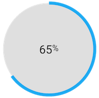
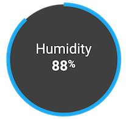

Custom element for lovelace picture-elements card




**Note: When including this file in your `ui-lovelace.yaml` you must use `type: module`**

## Config

| Name | Type | Description | Default
| ---- | ---- | ----------- | -------
| type | string | `custom:circle-sensor-element` | **Required**
| entity | string | `sensor.temperature` | **Required**
| name | string | Name to display above sensor value | none
| min | number | Minimum value | `0`
| max | number | Maximum value | `100`
| font_size | string | Base font size | `1em`
| fill | string | Background color of circle | `rgba(255, 255, 255, .75)`
| stroke_width | number | width of circle value indication ring | `6`
| gradient | boolean | whether to smoothly transition between color stops | `false`
| stroke_color | hex code | default stroke color | `#03a9f4`
| color_stops | object | sensor value to color mapping (see below) | none

## Color stops
A mapping from `value` to `color`. If `gradient` is set to true, mid-stop colors will be
calculated on a linear gradient from one stop to the next.

```yaml
color_stops:
  50: '#84B821'
  100: '#D43214' 
```

## Example
```yaml
- type: custom:circle-sensor-element
  entity: sensor.outside_temperature
  max: 120
  min: 30
  stroke_width: 10
  font_size: 1.5em
  gradient: true
  color_stops:
    50: '#55FF55'
    75: '#5555FF'
    100: '#FF5555'
  style:
    top: 50%
    left: 50%
    width: 75px
    height: 75px
```
